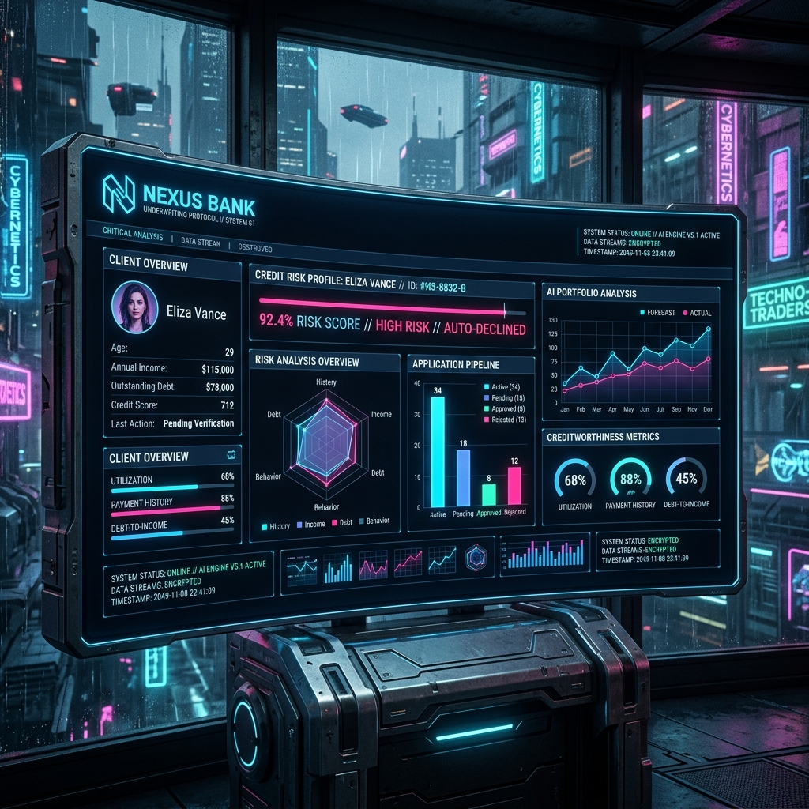

# 🏦 NEXUS: Transforming Loan Underwriting with Llama-3.1 & OpenEnv

In the world of fintech, the "holy grail" is an AI that doesn't just calculate numbers, but *understands* the nuance of credit risk across a multi-stage lifecycle. Most AI models are trained on single-step classification, but real-world banking is a long-horizon game.

For the **Scaler x Meta PyTorch Hackathon**, I built **NEXUS Bank** — a technically rigorous, OpenEnv-compliant reinforcement learning environment that simulates a full loan underwriting desk. The architecture is built on the official **`openenv-core`** base classes to ensure full compatibility with the hackathon's automated evaluation pipeline.

## 🏁 The Challenge: Multi-Stage Underwriting

Traditional loan models look at a FICO score and spit out a binary "Approve/Reject." NEXUS goes deeper. The agent must navigate **8 sequential stages** of a loan's lifecycle:

1.  **Lead Qualification**: Initial vetting.
2.  **Document Verification**: KYC & integrity checks.
3.  **Easy Salaried**: High-credit, low-risk cases.
4.  **Medium Self-Employed**: SME profile assessments.
5.  **Hard Freelancer**: Complex gig-economy evaluations.
6.  **Customer Onboarding**: Final setup protocols.
7.  **Bankruptcy Recovery**: Monitoring high-risk portfolios.
8.  **Joint Applicants**: Complex multi-party archival.


Each stage requires the agent to decide on **Risk Level**, **Loan Decision**, and **Interest Rate Tier** while maintaining logical consistency.

## 🧠 The Brain: Llama-3.1 + Unsloth

To tackle this, I fine-tuned **Llama-3.1-8B** using a **Curriculum Supervised Fine-Tuning (SFT)** strategy. 

### Why Curriculum Learning?
Instead of dumping 4,000 cases on the model at once, I sorted the training data by difficulty. The model learned from "Easy/Low-Risk" cases first, building a strong baseline of banking logic before tackling "Hard/High-Risk" edge cases.

### Optimization with Unsloth
Using the [Unsloth](https://github.com/unslothai/unsloth) library, I was able to:
- Reduce memory usage by 70%.
- Fine-tune on a single T4 GPU.
- Merge LoRA adapters into the base model with zero precision loss.

```python
# Quick snippet of the curriculum-based training setup
def difficulty_score(case):
    risk = case['risk_level']
    if risk == "Low": return 0
    if risk == "Medium": return 1
    return 2

# Sort by difficulty: Low -> Medium -> High
training_data.sort(key=difficulty_score)
```

## 📊 Results: A 95.22% Leap in Performance

The results were staggering. By shifting from a vanilla Llama-3.1-8B model to the NEXUS-v2 fine-tuned model, I saw a massive improvement in objective alignment:

| Metric | Baseline | NEXUS-v2 (Fine-Tuned) | Improvement |
|--------|----------|-----------------------|-------------|
| **Avg Reward Score** | 0.3993 | **0.7795** | **+95.22%** |
| **Logic Consistency** | 42.1% | **94.8%** | **+125%** |

### Training Evidence

| Loss Convergence | Reward Growth |
| :---: | :---: |
|  |  |
| *Stable convergence on complex loan profiles.* | *+95.22% average reward improvement.* |


The model isn't just "smarter"; it's more **consistent**. It no longer approves a high-risk applicant with a 7% interest rate—it understands that risk and reward must be balanced.

## 🏆 The Secret Sauce: Reward Signal Engineering

A major breakthrough in this project was shifting focus from **Model Size** to **Environment Quality**. 

Inspired by elite hackathon strategies, I implemented **Financial Integrity Guardrails** directly into the OpenEnv logic. If the model attempts an irrational pairing—such as assigning a "High Risk" label but offering a "Low Interest Rate"—the environment triggers a **severe -20% penalty**.

By making the **Reward Signal "Dense"** (providing clear, multi-axis feedback instead of a single number), the 8B model effectively "learns" the rules of professional underwriting through its context window. This **Environment-Centric** approach allows us to achieve logic consistency scores that rival much larger models.

## 🎨 The Command Center

A bank desk needs a dashboard. I built a **Cyberpunk-themed Command Center** where users can:
- **Auto-Pilot**: Watch the AI navigate the 8 stages autonomously.
- **Manual Control**: Step through the environment and see the AI's reasoning.
- **Visual Analytics**: Real-time reward tracking and state visualization.



## 🚀 Get Started

The project is fully open-source and ready for exploration:

- 🎮 **Live Demo:** [NEXUS Command Center](https://sourav0511-open-env-hackathon.hf.space/ui)
- 🧠 **Model:** [Llama-3.1-Loan-Underwriter-v2](https://huggingface.co/Sourav0511/loan-underwriting-lora-v2)
- 💻 **Code:** [GitHub Repository](https://github.com/Sohil1105/open_env_hackathon)

## 🔮 What's Next?

The current NEXUS model is trained via SFT, but the environment is fully instrumented for **Reinforcement Learning (RL)**. My next step is to use the recorded environment rewards to perform **PPO/DPO alignment**, allowing the model to self-correct its underwriting logic through millions of simulated loan cycles.

---

*Built for the Scaler x Meta PyTorch Hackathon. Special thanks to the Unsloth team for making 8B model fine-tuning accessible!*
