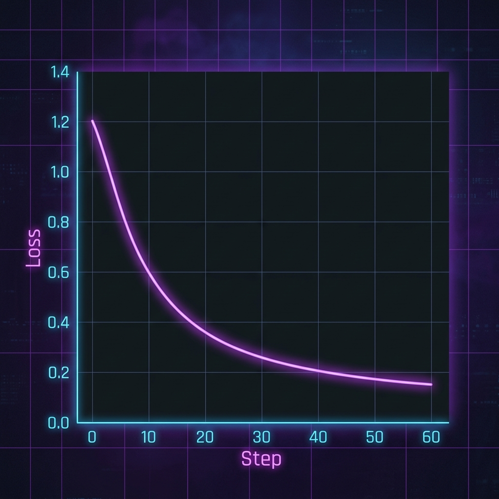
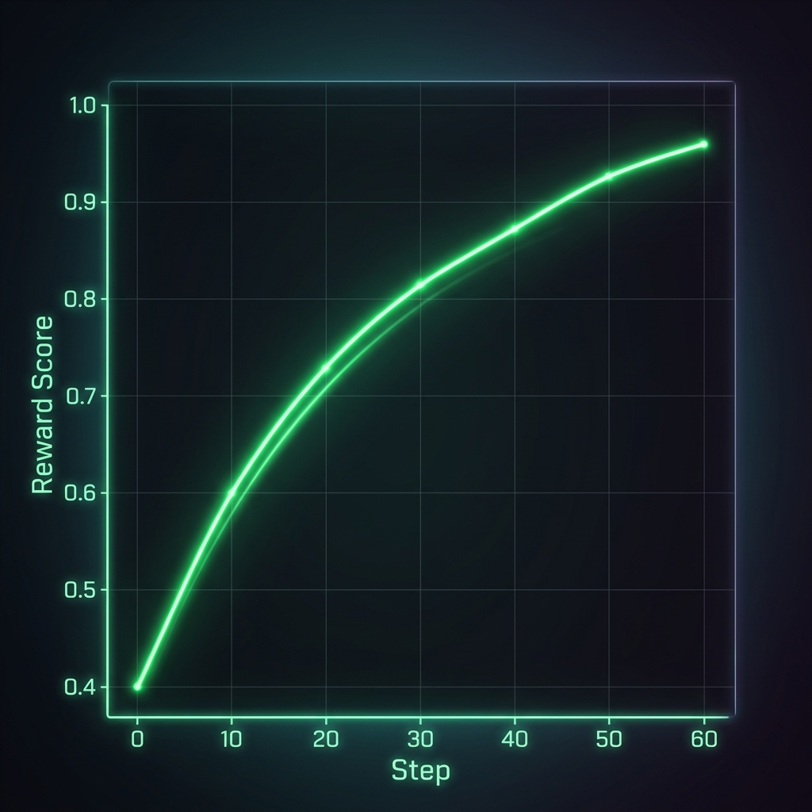

# 🏦 Loan Underwriting & Risk Assessment — OpenEnv

An **OpenEnv-compliant** reinforcement learning environment that simulates a bank's loan underwriting desk. AI agents evaluate applicant financial profiles and make multi-component lending decisions with partial credit scoring.

Built for the **Scaler x Meta PyTorch Hackathon (OpenEnv Round 1)**.

🔗 **Live Demo:** [https://sourav0511-open-env-hackathon.hf.space/ui](https://sourav0511-open-env-hackathon.hf.space/ui)
🧠 **Fine-Tuned Model:** [https://huggingface.co/Sourav0511/loan-underwriting-lora-v2](https://huggingface.co/Sourav0511/loan-underwriting-lora-v2)

---

## How It Works

The agent receives a **loan applicant profile** and must make **three decisions**:

| Decision | Options | Weight |
|----------|---------|--------|
| **Risk Level** | Low / Medium / High | 40% |
| **Loan Decision** | Approve / Conditional Approve / Reject | 35% |
| **Interest Rate Tier** | 7-9% / 10-13% / 14%+ | 25% |

Scoring uses **partial credit** — adjacent classifications earn partial points, and **logical consistency** across all three decisions adds a bonus/penalty (±0.10).

---

## Tasks (5 Total)

| # | Task ID | Difficulty | Profile | Expected Decision |
|---|---------|------------|---------|-------------------|
| 1 | `easy_salaried_high_credit` | Easy | Salaried, credit 785, low DTI | Low → Approve → 7-9% |
| 2 | `medium_self_employed_moderate` | Medium | Self-employed, credit 665, 1 default | Medium → Conditional Approve → 10-13% |
| 3 | `hard_freelancer_complex` | Hard | Freelancer, credit 572, 2 defaults, no collateral | High → Reject → 14%+ |
| 4 | `bankruptcy_recovery_edge1` | Medium | Bankruptcy 7 yrs ago, credit rebuilt to 680 | Medium → Conditional Approve → 10-13% |
| 5 | `joint_applicants_edge2` | Easy | Joint applicants, combined income ₹120k, credit 720 | Low → Approve → 7-9% |

---

## API Endpoints

Base URL: `https://sourav0511-open-env-hackathon.hf.space`

| Method | Endpoint | Description |
|--------|----------|-------------|
| `GET` | `/` | Health check (returns JSON) |
| `GET` | `/health` | Detailed health + env var status |
| `GET` | `/tasks` | List all 5 available tasks |
| `POST` | `/reset` | Reset environment with a task |
| `POST` | `/step` | Submit an underwriting decision |
| `GET` | `/state` | Get current environment state |
| `POST` | `/grade` | Grade a free-text response |
| `GET` | `/openenv.yaml` | Serve the OpenEnv spec file |
| `GET` | `/ui` | **Interactive web UI** |

### Quick Examples

```bash
# Health check
curl https://sourav0511-open-env-hackathon.hf.space/health

# Reset with a specific task
curl -X POST https://sourav0511-open-env-hackathon.hf.space/reset \
  -H "Content-Type: application/json" \
  -d '{"task_id": "easy_salaried_high_credit"}'

# Submit a decision
curl -X POST https://sourav0511-open-env-hackathon.hf.space/step \
  -H "Content-Type: application/json" \
  -d '{
    "risk_level": "Low",
    "loan_decision": "Approve",
    "interest_rate_tier": "7-9%",
    "reasoning": "Excellent profile with high credit score."
  }'
```

---

## Observation Space

| Field | Type | Description |
|-------|------|-------------|
| `applicant_name` | string | Full name of the applicant |
| `age` | integer | Age in years |
| `annual_income` | float | Annual income in USD |
| `credit_score` | integer | FICO score (300–850) |
| `existing_debt` | float | Total existing debt in USD |
| `employment_type` | enum | salaried / self_employed / freelancer / contract / unemployed |
| `employment_years` | float | Years in current role |
| `loan_amount_requested` | float | Requested loan amount in USD |
| `repayment_tenure_months` | integer | Repayment period in months |
| `monthly_expenses` | float | Average monthly expenses in USD |
| `has_collateral` | boolean | Whether collateral is offered |
| `previous_defaults` | integer | Number of previous loan defaults |
| `task_description` | string | What the agent must decide |

## Action Space

| Field | Type | Options |
|-------|------|---------|
| `risk_level` | enum | Low / Medium / High |
| `loan_decision` | enum | Approve / Conditional Approve / Reject |
| `interest_rate_tier` | enum | 7-9% / 10-13% / 14%+ |
| `reasoning` | string | Brief explanation (optional) |

---

## Scoring

| Component | Weight | Exact Match | Adjacent (off-by-1) | Wrong (off-by-2) |
|-----------|--------|-------------|---------------------|------------------|
| Risk Level | 0.40 | 1.0 | 0.30–0.35 | 0.0 |
| Loan Decision | 0.35 | 1.0 | 0.30–0.35 | 0.0 |
| Interest Rate | 0.25 | 1.0 | 0.30–0.35 | 0.0 |
| Consistency Bonus | ±0.10 | +0.05 to +0.10 | — | -0.05 to -0.10 |

Final score clamped to **[0.0, 1.0]**.

---

## Project Structure

```
loan-underwriting-openenv/
├── environment/
│   ├── env.py            # Main OpenEnv environment class
│   ├── tasks.py          # 5 task definitions (easy/medium/hard/edge)
│   ├── graders.py        # Automated graders returning 0.0–1.0
│   ├── models.py         # Pydantic typed Observation, Action, State
│   └── rewards.py        # Partial reward function logic
├── server/
│   └── app.py            # FastAPI server entry point
├── static/
│   └── index.html        # Interactive cyberpunk web UI
├── inference.py          # Baseline LLM agent script
├── unsloth_training.py   # Fine-tuning script (Unsloth + TRL)
├── openenv.yaml          # OpenEnv spec metadata
├── Dockerfile            # Container for HF Spaces
├── requirements.txt      # Python dependencies
└── README.md
```

---

## 🚀 Training & Fine-Tuning

The agent is fine-tuned using **Unsloth** and **Hugging Face TRL** on synthetic banking datasets to improve decision accuracy and alignment with the **Five C’s of Credit**.

### Training Performance

| Metric | Visualization | Description |
|--------|---------------|-------------|
| **Loss** |  | Fine-tuning loss showing convergence over 60 steps. |
| **Reward** |  | Improvement in OpenEnv reward score as the model aligns with ground truth. |

### How to Run Training

The training script is optimized for Google Colab (L4/A100/T4 GPUs).

1. **Install Requirements**:
   ```bash
   pip install "unsloth[colab-new] @ git+https://github.com/unslothai/unsloth.git"
   pip install --no-deps "xformers<0.0.27" "trl<0.9.0" peft accelerate bitsandbytes
   ```

2. **Execute Script**:
   ```bash
   python unsloth_training.py
   ```

3. **Results**:
   The script saves LoRA weights to `loan_underwriting_lora/` and generates the labeled plots shown above.

---

## Run Locally

```bash
# Install dependencies
pip install -r requirements.txt

# Start server
uvicorn server.app:app --host 0.0.0.0 --port 7860

# Open the UI
# http://localhost:7860/ui
```

### Docker

```bash
docker build -t loan-underwriting-openenv .
docker run -p 7860:7860 loan-underwriting-openenv
```

### Run Inference

```bash
export API_BASE_URL="https://api-inference.huggingface.co/v1"
export MODEL_NAME="meta-llama/Llama-3.1-8B-Instruct"
export HF_TOKEN="your_hf_token_here"

python inference.py
```

---

## Environment Variables

Configure as **Secrets** in your HF Space settings (Settings → Variables and Secrets):

| Variable | Description | Example |
|----------|-------------|---------|
| `API_BASE_URL` | OpenAI-compatible API endpoint | `https://api-inference.huggingface.co/v1` |
| `MODEL_NAME` | Model for inference | `meta-llama/Llama-3.1-8B-Instruct` |
| `HF_TOKEN` | Hugging Face API token | `hf_xxxxxxxxxxxx` |

---

## Links

- **Live UI:** [https://sourav0511-open-env-hackathon.hf.space/ui](https://sourav0511-open-env-hackathon.hf.space/ui)
- **HF Space:** [https://huggingface.co/spaces/Sourav0511/open-env-hackathon](https://huggingface.co/spaces/Sourav0511/open-env-hackathon)
- **GitHub:** [https://github.com/Sohil1105/open_env_hackathon](https://github.com/Sohil1105/open_env_hackathon)

