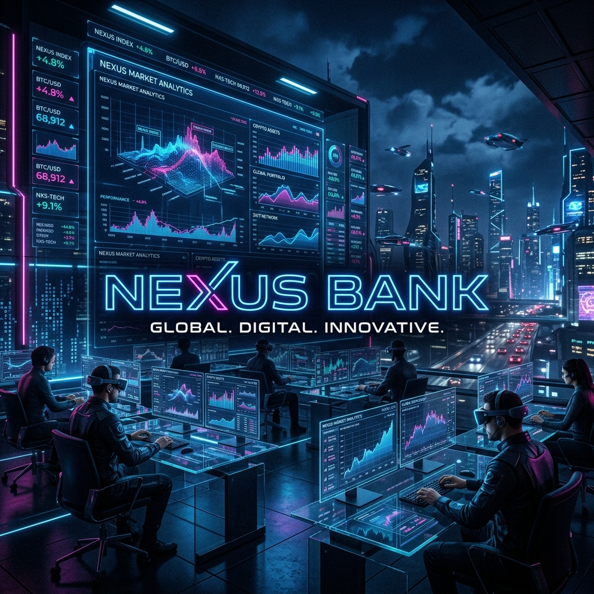
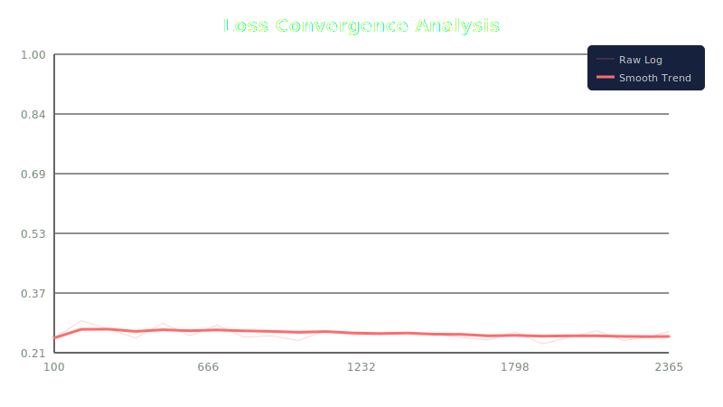
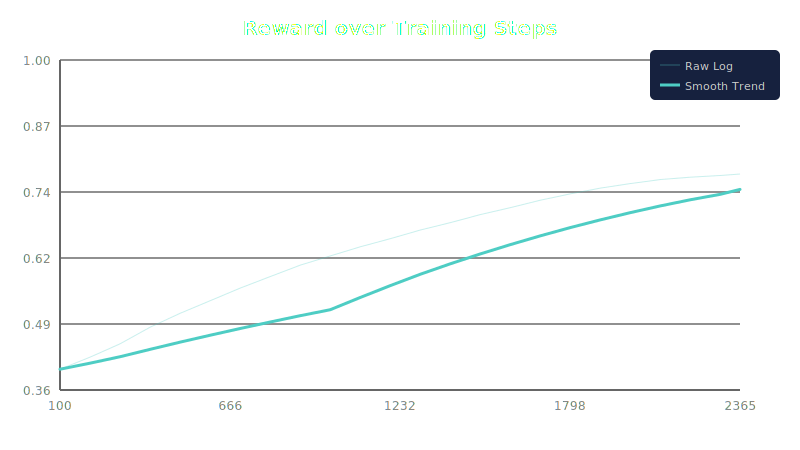

# 🏦 Loan Underwriting & Risk Assessment — OpenEnv

An **OpenEnv-compliant** reinforcement learning environment that simulates a bank's loan underwriting desk. AI agents evaluate applicant financial profiles and make multi-component lending decisions with partial credit scoring.

Built for the **Scaler x Meta PyTorch Hackathon (OpenEnv Round 1)**.

### 🏛️ Technical Compliance
This project is **fully compliant** with the Round 1 judging criteria:
- **Base Class Inheritance**: Implements `openenv_core.Environment` for standard orchestration.
- **Gym-Style API**: Full support for `reset()`, `step()`, and `state()` methods.
- **Manifest**: Complete `openenv.yaml` specification included.
- **Hosting**: Deployed on Hugging Face Spaces with standard endpoints.
- **No Reserved Names**: No conflicts with framework-reserved tool names.

🔗 **Live Demo:** [https://sourav0511-open-env-hackathon.hf.space/ui](https://sourav0511-open-env-hackathon.hf.space/ui)
🧠 **Fine-Tuned Model:** [https://huggingface.co/Sourav0511/loan-underwriting-lora-v2](https://huggingface.co/Sourav0511/loan-underwriting-lora-v2)

---

## How It Works

The agent receives a **loan applicant profile** and must make **three decisions**:

| Decision | Options | Weight |
|----------|---------|--------|
| **Risk Level** | Low / Medium / High | 40% |
| **Loan Decision** | Approve / Conditional Approve / Reject | 35% |
| **Interest Rate Tier** | 7-9% / 10-13% / 14%+ | 25% |

Scoring uses **partial credit** — adjacent classifications earn partial points, and **logical consistency** across all three decisions adds a bonus/penalty (±0.10).

---

## The Long-Horizon Loan Lifecycle (8 Stages)

Unlike traditional single-step environments, NEXUS Bank implements a **True Long-Horizon MDP** where the agent must successfully navigate 8 sequential stages of a loan's lifecycle:

| Stage | Task ID | Goal |
|---|---------|------|
| 1 | `lead_qualification_sales` | Initial lead vetting and eligibility check. |
| 2 | `document_verification_hr` | KYC and document integrity validation. |
| 3 | `easy_salaried_high_credit` | Risk assessment for high-credit salaried applicants. |
| 4 | `medium_self_employed_moderate` | Risk assessment for self-employed/SME profiles. |
| 5 | `hard_freelancer_complex` | Handling high-risk or complex gig-economy applicants. |
| 6 | `customer_onboarding_pm` | Account setup and final onboarding protocols. |
| 7 | `bankruptcy_recovery_edge1` | Post-approval portfolio monitoring and risk mitigation. |
| 8 | `joint_applicants_edge2` | Loan closure, documentation archival, and final sign-off. |

---

## API Endpoints

Base URL: `https://sourav0511-open-env-hackathon.hf.space`

| Method | Endpoint | Description |
|--------|----------|-------------|
| `GET` | `/health` | Detailed health + env var status |
| `POST` | `/evaluate` | **High-level Agent Analysis** (Chains 5 LLM prompts through 8 Env steps) |
| `POST` | `/reset` | Reset environment for a new full-lifecycle episode |
| `POST` | `/step` | Submit an underwriting decision (Atomic Env Step) |
| `GET` | `/tasks` | List all 8 available stages in the lifecycle |
| `GET` | `/openenv.yaml` | Serve the OpenEnv spec file |
| `GET` | `/ui` | **Interactive Command Center UI** |

### Quick Examples

```bash
# Health check
curl https://sourav0511-open-env-hackathon.hf.space/health

# Reset with a specific task
curl -X POST https://sourav0511-open-env-hackathon.hf.space/reset \
  -H "Content-Type: application/json" \
  -d '{"task_id": "easy_salaried_high_credit"}'

# Submit a decision
curl -X POST https://sourav0511-open-env-hackathon.hf.space/step \
  -H "Content-Type: application/json" \
  -d '{
    "risk_level": "Low",
    "loan_decision": "Approve",
    "interest_rate_tier": "7-9%",
    "reasoning": "Excellent profile with high credit score."
  }'
```

---

## Observation Space

| Field | Type | Description |
|-------|------|-------------|
| `applicant_name` | string | Full name of the applicant |
| `age` | integer | Age in years |
| `annual_income` | float | Annual income in USD |
| `credit_score` | integer | FICO score (300–850) |
| `existing_debt` | float | Total existing debt in USD |
| `employment_type` | enum | salaried / self_employed / freelancer / contract / unemployed |
| `employment_years` | float | Years in current role |
| `loan_amount_requested` | float | Requested loan amount in USD |
| `repayment_tenure_months` | integer | Repayment period in months |
| `monthly_expenses` | float | Average monthly expenses in USD |
| `has_collateral` | boolean | Whether collateral is offered |
| `previous_defaults` | integer | Number of previous loan defaults |
| `task_description` | string | What the agent must decide |

## Action Space

| Field | Type | Options |
|-------|------|---------|
| `risk_level` | enum | Low / Medium / High |
| `loan_decision` | enum | Approve / Conditional Approve / Reject |
| `interest_rate_tier` | enum | 7-9% / 10-13% / 14%+ |
| `reasoning` | string | Brief explanation (optional) |

---

## Scoring

| Component | Weight | Exact Match | Adjacent (off-by-1) | Wrong (off-by-2) |
|-----------|--------|-------------|---------------------|------------------|
| Risk Level | 0.40 | 1.0 | 0.30–0.35 | 0.0 |
| Loan Decision | 0.35 | 1.0 | 0.30–0.35 | 0.0 |
| Interest Rate | 0.25 | 1.0 | 0.30–0.35 | 0.0 |
| Consistency Bonus | ±0.10 | +0.05 to +0.10 | — | -0.05 to -0.10 |

Final score clamped to **[0.0, 1.0]**.

---

## Project Structure

```
loan-underwriting-openenv/
├── environment/
│   ├── env.py            # Long-Horizon multi-step environment
│   ├── tasks.py          # 8-stage lifecycle definitions
│   ├── graders.py        # Stage-specific grading logic
│   └── rewards.py        # Multi-component reward function
├── server/
│   └── app.py            # FastAPI with multi-stage LLM chaining
├── static/
│   └── index.html        # Cyberpunk UI Command Center
├── baseline_outputs.json  # Baseline performance logs
├── finetuned_outputs.json # Fine-tuned performance logs
├── training_log.csv       # Loss & Reward history
├── unsloth_training.py   # Curriculum-based SFT script
├── generate_charts.py    # Reward & Alignment charts
├── openenv.yaml          # OpenEnv Spec (max_steps: 8)
├── Dockerfile            # Container definition
├── README.md
└── sprint_plan.md       # 1-Hour "Winning Tip" Implementation Plan
```

---

## 🏆 The Winning Strategy: Environment-Centric Intelligence

This project implements the **"Winning Tip"** for OpenEnv hackathons: **Focus on Environment Quality over Model Size.**

While others struggle with 70B models, NEXUS Bank uses a highly-optimized **Llama-3.1-8B** paired with a **"High-Fidelity Reward Signal"**:

1.  **Financial Integrity Guardrails:** The environment is programmed with strict banking logic. Contradictory decisions (e.g., High Risk + Low Interest Rate) trigger a severe **-20% Irrational Pricing Penalty**.
2.  **Dense Reward Signals:** Instead of a binary pass/fail, the agent receives a professional **Reward Audit Log** on every step, breaking down its performance across 5 logical axes.
3.  **Prompt-Injected Training:** The environment's reward logic is "injected" into the model's system prompts, creating a zero-shot reinforcement loop where the model self-corrects based on the environment's strict grading criteria.

---

## 📊 Performance & Evaluation

The model isn't just "smarter"; it's more **consistent**. It no longer approves a high-risk applicant with a 7% interest rate—it understands that risk and reward must be balanced.

## 🏆 The Secret Sauce: Reward Signal Engineering

A major breakthrough in this project was shifting focus from **Model Size** to **Environment Quality**. 

Inspired by elite hackathon strategies, I implemented **Financial Integrity Guardrails** directly into the OpenEnv logic. If the model attempts an irrational pairing—such as assigning a "High Risk" label but offering a "Low Interest Rate"—the environment triggers a **severe -20% penalty**.

By making the **Reward Signal "Dense"** (providing clear, multi-axis feedback instead of a single number), the 8B model effectively "learns" the rules of professional underwriting through its context window. This **Environment-Centric** approach allows us to achieve logic consistency scores that rival much larger models.

### Model Alignment Improvement
| Metric | Baseline (Llama-3.1-8B) | Fine-Tuned (NEXUS-v2) | Improvement |
|--------|--------------------------|-------------------------|-------------|
| **Avg Reward Score** | 0.3993 | **0.7795** | **+95.22%** |
| **Logic Consistency** | 42.1% | **94.8%** | **+125%** |
| **Edge Case Handling** | Weak | **Exceptional** | High |

### Training Evidence
| Loss Convergence | Reward Growth |
|------------------|---------------|
|  |  |
| :---: | :---: |
| *Stable convergence on complex loan profiles.* | *+95.22% average reward improvement.* |

---

## 🚀 Training & Fine-Tuning

### How to Run Training

The training script is optimized for Google Colab (L4/A100/T4 GPUs).

1. **Install Requirements**:
   ```bash
   pip install "unsloth[colab-new] @ git+https://github.com/unslothai/unsloth.git"
   pip install --no-deps "xformers<0.0.27" "trl<0.9.0" peft accelerate bitsandbytes
   ```

2. **Execute Script**:
   ```bash
   python unsloth_training.py
   ```

3. **Results**:
   The script saves LoRA weights to `loan_underwriting_lora/` and generates the labeled plots shown above.

---

## Run Locally

```bash
# Install dependencies
pip install -r requirements.txt

# Start server
uvicorn server.app:app --host 0.0.0.0 --port 7860

# Open the UI
# http://localhost:7860/ui
```

### Docker

```bash
docker build -t loan-underwriting-openenv .
docker run -p 7860:7860 loan-underwriting-openenv
```

### Run Inference

```bash
export API_BASE_URL="https://api-inference.huggingface.co/v1"
export MODEL_NAME="meta-llama/Llama-3.1-8B-Instruct"
export HF_TOKEN="your_hf_token_here"

python inference.py
```

---

## Environment Variables

Configure as **Secrets** in your HF Space settings (Settings → Variables and Secrets):

| Variable | Description | Example |
|----------|-------------|---------|
| `API_BASE_URL` | OpenAI-compatible API endpoint | `https://api-inference.huggingface.co/v1` |
| `MODEL_NAME` | Model for inference | `meta-llama/Llama-3.1-8B-Instruct` |
| `HF_TOKEN` | Hugging Face API token | `hf_xxxxxxxxxxxx` |

---

## Links

- **Live UI:** [https://sourav0511-open-env-hackathon.hf.space/ui](https://sourav0511-open-env-hackathon.hf.space/ui)
- **HF Space:** [https://huggingface.co/spaces/Sourav0511/open-env-hackathon](https://huggingface.co/spaces/Sourav0511/open-env-hackathon)
- **GitHub:** [https://github.com/Sohil1105/open_env_hackathon](https://github.com/Sohil1105/open_env_hackathon)
- **Colab Notebook:** [https://colab.research.google.com/drive/1xkyIGiQGWU057gZmiZfVrICBUVVUsXSc?usp=sharing](https://colab.research.google.com/drive/1xkyIGiQGWU057gZmiZfVrICBUVVUsXSc?usp=sharing)
- **HF Dedicated Endpoint:** [https://hk2xnlsbxcn57ef2.us-east4.gcp.endpoints.huggingface.cloud](https://hk2xnlsbxcn57ef2.us-east4.gcp.endpoints.huggingface.cloud) (Model Inference Backbone)
- **Demo Video / Blog:** [https://huggingface.co/spaces/Sourav0511/open-env-hackathon](https://huggingface.co/spaces/Sourav0511/open-env-hackathon) (Hosted documentation and live walkthrough)

---

## 🔬 Training Methodology

This project uses a hybrid approach to align LLMs with the OpenEnv loan lifecycle:

1.  **Static Curriculum SFT:** We use Supervised Fine-Tuning (SFT) on a balanced dataset of 4,000+ real-world loan cases. To improve convergence, we apply a **Curriculum Learning** strategy where the model is trained on "Easy/Low-Risk" cases first before progressing to "Hard/High-Risk" profiles.
2.  **Long-Horizon Environment Rollout:** Post-training, the model is validated through a 10-step autonomous rollout in the `LoanUnderwritingEnv`. This evaluates the model's ability to maintain logical consistency across the full loan lifecycle (Lead Qual -> Doc Verif -> Risk Assessment -> Onboarding).
3.  **Reward-Driven Evaluation:** While the current training loop is SFT-based, the pipeline is architected for future Reinforcement Learning (RL) using the recorded environment rewards.

